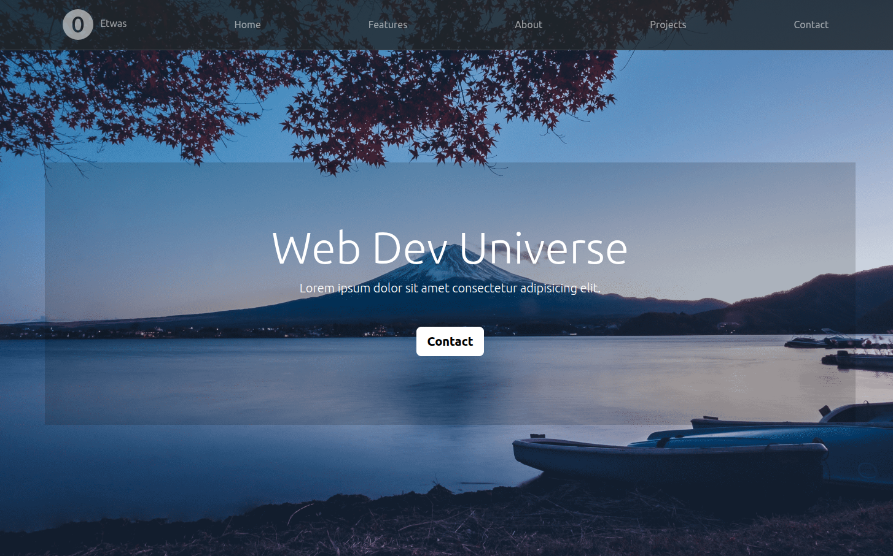
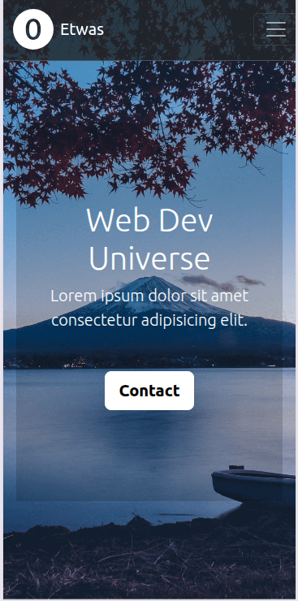

# 🚀 Bootstrap Playground

A small front-end experiment built to get hands-on experience with **Bootstrap 5** components, layout systems, and responsive utilities. This project is static and deployed with **GitHub Pages**.

🔗 **Live demo**: [https://marrozhkova.github.io/git-boostrap/](https://marrozhkova.github.io/git-boostrap/)

---

## 🧑‍🎓 Purpose

This project was created while I was getting acquainted with Bootstrap’s:

- Grid layout system
- Navbar components
- Cards, buttons & responsive utilities
- Typography, spacing, and alignment helpers

It’s not a full-featured app — it’s a **learning sandbox** for building static content quickly with Bootstrap conventions.

---

## 🛠️ Tech Stack

- **HTML5**
- **CSS3**
- **Bootstrap 5**
- **GitHub Pages** for deployment

---

## 📸 Screenshots

| Desktop | Mobile |
|---------|--------|
|  |  |

---

## 🚀 Local Setup

```bash
git clone https://github.com/marrozhkova/git-boostrap.git
cd git-boostrap
# Open index.html in your browser
